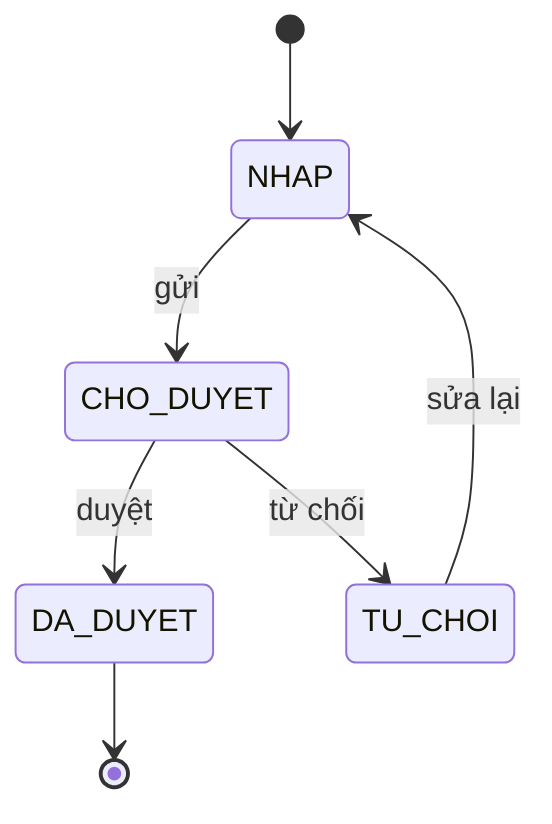

# SPEC-<NNN>: <Tên quy trình>

| Trường          | Giá trị                     |
| --------------- | --------------------------- |
| Trạng thái spec | Nháp / Chờ duyệt / Đã duyệt |
| Người yêu cầu   |                             |
| Ngày            |                             |
| Module          |                             |

## 1. Mục tiêu và phạm vi

Vấn đề cần giải quyết, kết quả đo được. Trong phạm vi / ngoài phạm vi.

## 2. Quyền

Quyền module khai báo (vai trò do quản trị viên tự gom trên giao diện, xem ADR-0004):

| Quyền (`module.hanh_dong`) | Cho phép |
| -------------------------- | -------- |

Phạm vi xem dữ liệu: quyền có cấp (`x.view.all` / `x.view.department` / mặc định của mình). Người ngoài phạm vi nhận
"không tìm thấy". Đề xuất vai trò mặc định (vai trò nào có quyền nào) để seed tạo:

| Vai trò mặc định | Quyền |
| ---------------- | ----- |

## 3. Thực thể dữ liệu

| Thực thể | Trường chính | Ràng buộc | Dữ liệu cá nhân? |
| -------- | ------------ | --------- | ---------------- |

## 4. Trạng thái và chuyển trạng thái

| Từ  | Sự kiện | Đến | Quyền cần có | Điều kiện | Tác động phụ (thông báo, tích hợp) |
| --- | ------- | --- | ------------ | --------- | ---------------------------------- |

## 5. Quy tắc nghiệp vụ

- **BR-01**:

## 6. Luồng xử lý

Luồng chính, luồng thay thế, ngoại lệ và cách xử lý (kể cả hai người thao tác cùng lúc).

## 7. Thông báo và tích hợp

| Sự kiện                                                                | Người nhận | Kênh | Nội dung |
| ---------------------------------------------------------------------- | ---------- | ---- | -------- |
| Tích hợp ngoài: hướng, tần suất, xử lý khi lỗi, có cần đối soát không. |

## 8. Báo cáo và xuất dữ liệu

Màn hình danh sách, bộ lọc, báo cáo, định dạng xuất, ai được xuất (xuất hàng loạt phải ghi audit).

## 9. Yêu cầu phi chức năng

Số người dùng đồng thời, thời gian phản hồi, thời gian lưu dữ liệu, audit, dữ liệu cá nhân và mục đích xử lý.

## 10. Tiêu chí nghiệm thu

- **AC-01**: Cho <bối cảnh>, Khi <hành động>, Thì <kết quả>.
- **AC-02** (từ chối quyền): Cho ..., Khi ..., Thì hệ thống báo "..." và không thay đổi dữ liệu.

## 11. Giả định và câu hỏi mở
