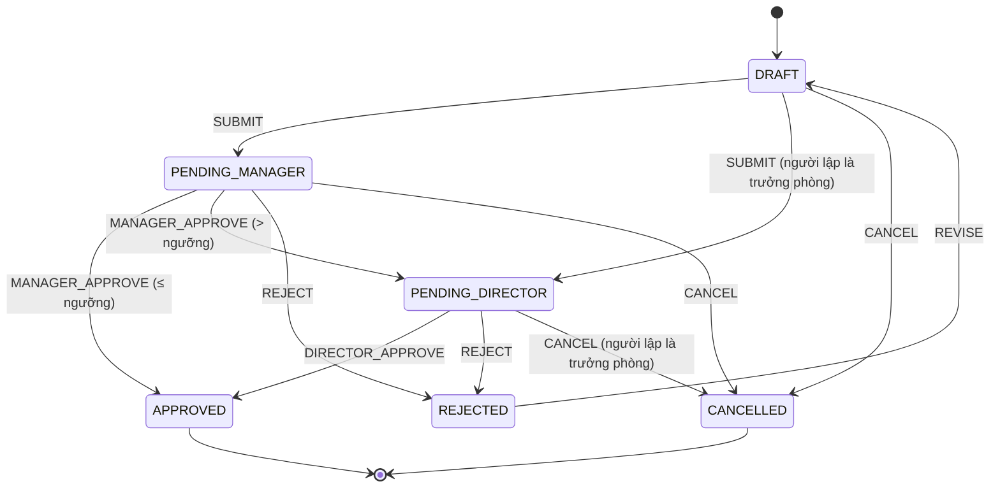

# SPEC-001: Phiếu đề nghị mua hàng (spec mẫu)

| Trường          | Giá trị                                  |
| --------------- | ---------------------------------------- |
| Trạng thái spec | Đã duyệt                                 |
| Module          | `apps/api/src/modules/purchase-requests` |

## 1. Mục tiêu và phạm vi

Số hóa quy trình đề nghị mua hàng: nhân viên lập phiếu, trưởng phòng duyệt, phiếu giá trị lớn qua giám đốc.
Ngoài phạm vi: đặt hàng nhà cung cấp, nhập kho, thanh toán.

## 2. Quyền

Module khai báo các quyền dưới đây (`PR_PERMISSIONS` trong `packages/shared/src/purchase-request.ts`). Quản trị viên gom
quyền thành vai trò trên màn "Vai trò" (ADR-0004); mã chỉ kiểm quyền, không kiểm tên vai trò.

| Quyền                   | Cho phép                                                                              |
| ----------------------- | ------------------------------------------------------------------------------------- |
| `pr.create`             | Lập, sửa, gửi, hủy phiếu của mình (người lập phải thuộc một phòng ban)                |
| `pr.view.department`    | Xem phiếu của phòng ban mình                                                          |
| `pr.view.all`           | Xem phiếu của mọi phòng ban                                                           |
| `pr.approve.department` | Duyệt/từ chối phiếu chờ trưởng phòng cùng phòng ban; phiếu mình lập đi thẳng cấp cuối |
| `pr.approve.final`      | Duyệt/từ chối phiếu chờ giám đốc                                                      |
| `pr.export`             | Xuất Excel danh sách phiếu (chỉ các phiếu mình được xem)                              |

Không có `pr.view.*` thì chỉ xem phiếu của mình. Vai trò mặc định do seed tạo (`apps/api/src/auth/default-roles.ts`):

| Vai trò mặc định  | Quyền                                                                   |
| ----------------- | ----------------------------------------------------------------------- |
| Nhân viên         | `pr.create`                                                             |
| Trưởng phòng      | `pr.create`, `pr.view.department`, `pr.approve.department`, `pr.export` |
| Kế toán           | `pr.create`, `pr.view.all`, `pr.export`                                 |
| Giám đốc          | `pr.view.all`, `pr.approve.final`, `pr.export`                          |
| Quản trị hệ thống | chỉ quyền quản trị (tách biệt nhiệm vụ, không có quyền nghiệp vụ)       |

Giám đốc là người duyệt cuối nên vai trò mặc định không có `pr.create` (không ai duyệt được phiếu của giám đốc).

## 3. Thực thể dữ liệu

| Thực thể          | Trường chính                                      | Ràng buộc                                              | Dữ liệu cá nhân? |
| ----------------- | ------------------------------------------------- | ------------------------------------------------------ | ---------------- |
| purchase_requests | code, title, items, total_amount, status, version | code duy nhất dạng PR-YYYY-NNNNNN; total tính từ items | Không            |
| audit_logs        | actor, action, before, after, ip                  | ghi cùng transaction                                   | Có (IP)          |

## 4. Trạng thái và chuyển trạng thái

## 5. Quy tắc nghiệp vụ

- **BR-01**: Chỉ người lập được sửa và gửi phiếu; chỉ sửa ở trạng thái Nháp.
- **BR-02**: Trưởng phòng chỉ duyệt/từ chối phiếu của phòng ban mình và không xử lý phiếu do chính mình lập.
- **BR-03**: Tổng tiền > 20.000.000 ₫ phải qua giám đốc sau trưởng phòng. Đúng bằng 20.000.000 ₫ thì trưởng phòng duyệt là xong.
- **BR-04**: Từ chối bắt buộc có lý do tối thiểu 10 ký tự; phiếu bị từ chối được người lập sửa lại về Nháp.
- **BR-05**: Người lập được hủy phiếu khi Nháp hoặc Chờ trưởng phòng duyệt (ngoại lệ cho trưởng phòng: xem BR-08).
- **BR-06**: Mọi thay đổi khóa dòng và kiểm phiên bản; hai người thao tác cùng lúc thì chỉ một người thành công, người còn lại
  nhận thông báo tải lại. Audit ghi cùng transaction.
- **BR-07**: Người ngoài phạm vi xem nhận "không tìm thấy", không lộ phiếu tồn tại.
- **BR-08**: Không ai tự duyệt phiếu của mình. Phiếu do trưởng phòng lập bỏ qua bước trưởng phòng, gửi thẳng giám đốc
  duyệt (kể cả dưới ngưỡng); trưởng phòng hủy được phiếu đó khi còn chờ giám đốc. Giám đốc và Quản trị không lập phiếu.
- **BR-09**: Đính kèm (lõi tệp, spec 002): ai xem được phiếu thì xem và tải được đính kèm; chỉ người lập (còn `pr.create`)
  thêm/xóa, khi phiếu Nháp hoặc Bị từ chối; tối đa 10 tệp; loại cho phép PDF, JPG, PNG, WEBP, XLSX, DOCX.
- **BR-10**: Xuất (lõi xuất file, spec 002): Excel danh sách theo bộ lọc đang xem cần `pr.export`; in PDF một phiếu không
  cần quyền riêng, ai xem được phiếu thì in được.

## 7. Thông báo

Mỗi lần đổi trạng thái đẩy job `pr.status_changed` sau khi commit; worker báo (lõi thông báo, spec 003) theo quyền hiện
tại, chỉ người xem được phiếu, không báo tài khoản bị khóa:

| Phiếu chuyển sang      | Người nhận                                                               | Loại                  |
| ---------------------- | ------------------------------------------------------------------------ | --------------------- |
| Chờ trưởng phòng duyệt | Người có `pr.approve.department` cùng phòng ban với phiếu, trừ người lập | `pr.pending_approval` |
| Chờ giám đốc duyệt     | Người có `pr.approve.final`, trừ người lập                               | `pr.pending_approval` |
| Đã duyệt               | Người lập                                                                | `pr.approved`         |
| Bị từ chối             | Người lập (kèm lý do)                                                    | `pr.rejected`         |

Job đến muộn khi phiếu đã sang trạng thái khác thì không báo trạng thái cũ.

## 10. Tiêu chí nghiệm thu

- **AC-01**: Cho nhân viên phòng KD, Khi lập phiếu 90.000 ₫ và gửi, rồi trưởng phòng KD duyệt, Thì phiếu "Đã duyệt". (E2E)
- **AC-02**: Cho phiếu 30.000.000 ₫, Khi trưởng phòng duyệt, Thì phiếu "Chờ giám đốc duyệt".
- **AC-03**: Cho trưởng phòng KT, Khi mở phiếu của phòng KD, Thì nhận "Không tìm thấy dữ liệu".
- **AC-04**: Cho hai thao tác duyệt và từ chối gửi cùng lúc, Thì chỉ một thành công, phiếu tăng đúng 1 phiên bản.
